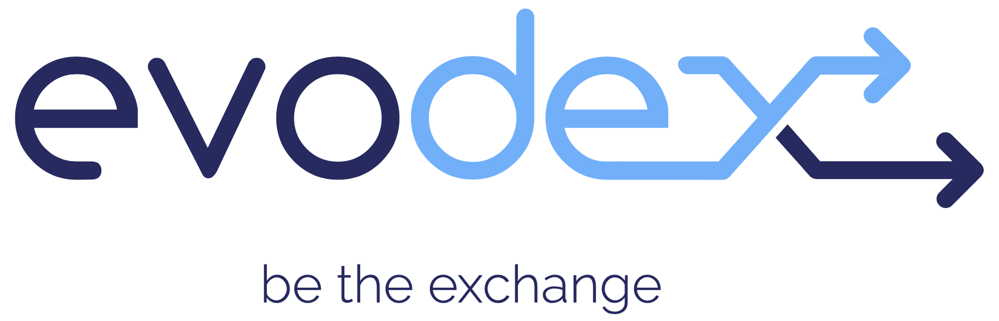

<p align="center">
	
</p>

<p align="center">
	
	<a href="http://standardjs.com">
		
	</a>
	<a href="https://git.io/col">
		
	</a>
	<a href="https://twitter.com/intent/follow?screen_name=eoscostarica">
		
	</a>
	<a href="#">
		
	</a>
</p>

# Official Web Interface for Evolution DEX

[Evolution DEX]( ​https://github.com/eosargentina/evolutiondex) is a Protocol created by EOS Argentina that allows anyone to create and launch their own trading pairs in a decentralized exchange and gain trading fees by adding liquidity to the token’s pool.

EOS Costa Rica  is working with EOS Argentina creating a web interface that will provide access to liquidity amongst all exchanges that connect to Evolution DEX.

This project is OpenSource and free for any developers to integrate it to their front end, in this way different exchanges can share the same liquidity.


## How is evodex unique ?

The main difference from say Uniswap on Ethereum, is that liquidity providers can vote for the fees they want to charge using a smart contract that calculates the fees proportional to the stake of every participant of the pool.

Another difference between EVODEX and UNISWAP comes from the different blockchains where they both operate, traders only pay fees to liquidity providers, but they don't have to pay transfer fees like in Ethereum and other networks.

#### Telegram Channel : [https://t.me/evodexarg](https://t.me/evodexarg)


## Version

- 0.1.0

## Tech Stack

This frontend features all the latest tools and practices in the industry.

- _React.js_ - **React 16**✨, React Router 5
- _Rematch/core_ - Rematch a Redux Framework
- _Material-ui/core_ - React components for faster and easier web development
- _universal-authenticator-library_ - A library for allowing apps to easily use different auth providers 
- _Lint_ - ESlint
- _Styles_ - Material-UI Theme (customizable)

## Development Environment

[**evodex.io**](https://evodex.io) is running on the EOS MainNet and is built from the `master` branch, our production branch.

[**jungle.evodex.io**](https://jungle.evodex.io) is running on the Jungle 3 TestNet and is built from the `develop` branch used for development, integration, and testing new features.  

## Installation

### Before to start

Somethings you need before getting started:

- [git](https://git-scm.com/)
- [node.js](https://nodejs.org/es/)
- [yarn](https://yarnpkg.com/)

### First time setup

Copy the `.env.example` then update the environment variables according to your needs

```
cp .env.example .env
```
In order to use  UAL login integration, please make sure that `REACT_APP_USE_UAL` env variable is set as true.

## Development

### Quick start

1.  Clone this repo using `git clone --depth=1 https://github.com/eoscostarica/evodex.git <YOUR_PROJECT_NAME>`
2.  Move to the appropriate directory: `cd <YOUR_PROJECT_NAME>`.
3.  Run `yarn` in order to install dependencies.
    _At this point you can run `yarn start` to see the example app at `http://localhost:3000`._

## File Structure

Within the download you'll find the following directories and files:

```
/
├── public
│   ├── index.html
│   └── manifest.json
├──  src
│   ├── api
│   ├── components
│   ├── config
│   ├── containers
│   ├── models
│   ├── routes
│   ├── theme
│   ├── utils
│   ├── App.js
│   ├── index.js
│   └── store.js
├── .dockerignore
├── .gitignore
├── .env.example
├── .eslintrc
├── .prettierrc
├── Dockerfile
├── LICENSE
├── README.md
├── docker-compose.yml
├── nginx.conf
└── package.json
```

## License

MIT © [EOS Costa Rica](https://eoscostarica.io)

## Contributing

Please Read EOS Costa Rica's [Open Source Contributing Guidelines](https://developers.eoscostarica.io/docs/open-source-guidelines).

Please report bugs big and small by [opening an issue](https://github.com/eoscostarica/evodex/issues)

## Contributors
Thanks goes to these wonderful people ([emoji key](https://github.com/kentcdodds/all-contributors#emoji-key)):

<!-- ALL-CONTRIBUTORS-BADGE:START - Do not remove or modify this section -->
[](#contributors-)
<!-- ALL-CONTRIBUTORS-BADGE:END -->

<!-- ALL-CONTRIBUTORS-LIST:START - Do not remove or modify this section -->
<!-- prettier-ignore-start -->
<!-- markdownlint-disable -->
<table>
  <tr>
    <td align="center"><a href="https://github.com/sergioyuhjtman"><br /><sub><b>Sergio Yuhjtman</b></sub></a><br /><a href="#ideas-sergioyuhjtman" title="Ideas, Planning, & Feedback">🤔</a> <a href="#translation-sergioyuhjtman" title="Translation">🌍</a></td>
    <td align="center"><a href="http://eoscostarica.io"><br /><sub><b>Jorge Murillo</b></sub></a><br /><a href="#design-murillojorge" title="Design">🎨</a></td>
    <td align="center"><a href="https://github.com/adriexnet"><br /><sub><b>adriel</b></sub></a><br /><a href="https://github.com/eoscostarica/evodex/commits?author=adriexnet" title="Code">💻</a> <a href="https://github.com/eoscostarica/evodex/pulls?q=is%3Apr+reviewed-by%3Aadriexnet" title="Reviewed Pull Requests">👀</a></td>
    <td align="center"><a href="https://eosio.cr"><br /><sub><b>Teto Gomez</b></sub></a><br /><a href="https://github.com/eoscostarica/evodex/commits?author=tetogomez" title="Code">💻</a> <a href="https://github.com/eoscostarica/evodex/pulls?q=is%3Apr+reviewed-by%3Atetogomez" title="Reviewed Pull Requests">👀</a></td>
    <td align="center"><a href="https://eoscostarica.io"><br /><sub><b>Xavier Fernandez</b></sub></a><br /><a href="#infra-xavier506" title="Infrastructure (Hosting, Build-Tools, etc)">🚇</a> <a href="https://github.com/eoscostarica/evodex/commits?author=xavier506" title="Documentation">📖</a> <a href="#projectManagement-xavier506" title="Project Management">📆</a></td>
    <td align="center"><a href="https://esoargentina.io"><br /><sub><b>J. Chitty</b></sub></a><br /><a href="#ideas-PixelNoob" title="Ideas, Planning, & Feedback">🤔</a> <a href="#content-PixelNoob" title="Content">🖋</a></td>  
  </tr>
</table>

<!-- markdownlint-enable -->
<!-- prettier-ignore-end -->
<!-- ALL-CONTRIBUTORS-LIST:END -->

This project follows the [all-contributors](https://github.com/kentcdodds/all-contributors) specification. Contributions of any kind welcome!

## About EOS Costa Rica

<p align="center">
	<a href="https://eoscostarica.io">
		
	</a>
</p>
<br/>

EOS Costa Rica is an independently-owned, self-funded, bare-metal Genesis block producer that provides stable and secure infrastructure for EOSIO blockchains. We support open source software for our community while offering enterprise blockchain development and custom smart contract development for our clients.

[eoscostarica.io](https://eoscostarica.io)
